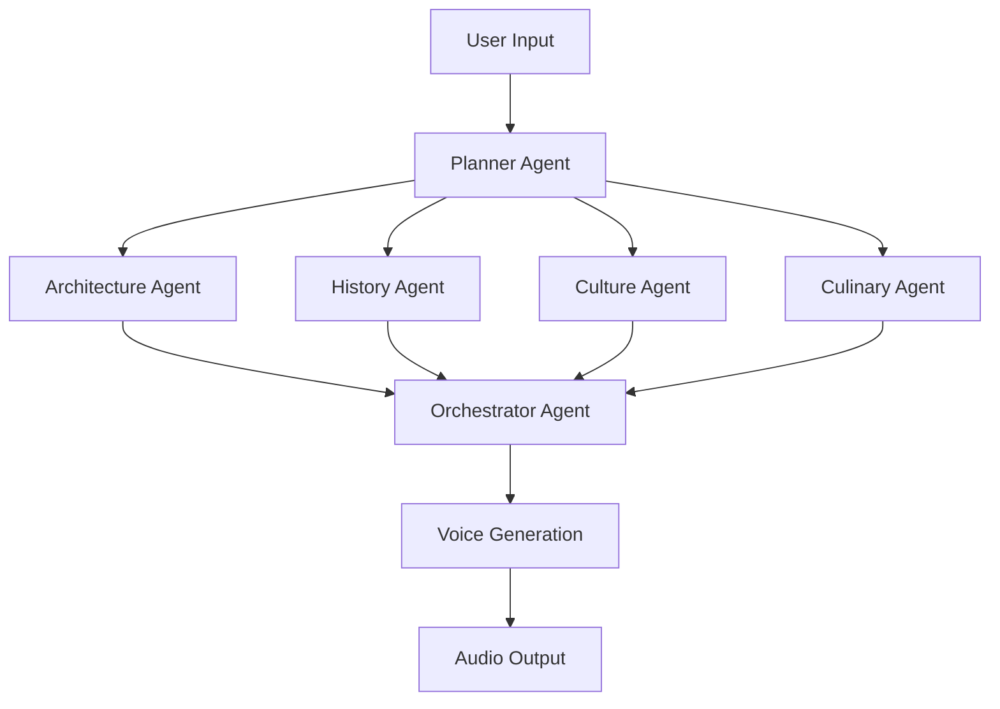

# 🎙️ Multi-Agent Voice RAG Platform

> **Transform any content into intelligent, voice-powered conversations**

[](https://streamlit.io/)
[](https://openai.com/)
[](https://python.org/)
[](https://faiss.ai/)

## 🌟 Overview

The **Multi-Agent Voice RAG Platform** is a cutting-edge system that combines Retrieval-Augmented Generation (RAG) with voice AI to create intelligent, conversational experiences. Transform documentation, customer support, and content discovery into natural voice interactions.

### ✨ Key Features

- 🎧 **AI Audio Tour Generator** - Create personalized, multi-agent audio experiences
- 🎤 **Voice-Powered Customer Support** - Intelligent query resolution with audio responses
- 🕷️ **Web Documentation RAG** - Crawl, index, and query any website with voice output
- 🧠 **Multi-Agent Architecture** - Specialized agents for different domains and tasks
- 🔊 **11 Voice Options** - Premium text-to-speech with multiple voice personalities
- 📱 **Responsive UI** - Beautiful, modern interface built with Streamlit

---

## 🚀 Live Demo

### Quick Start
```bash
git clone https://github.com/ancur4u/MultiAgent_Voice_RAG.git
cd MultiAgent_Voice_RAG
pip install -r requirements.txt
streamlit run multiagent_voice_rag.py
```


---

## 🎯 Business Use Cases

### 🏛️ **Tourism & Hospitality**
- **Smart Audio Tours**: Generate personalized city/museum tours in real-time
- **Hotel Concierge**: Voice-powered guest assistance and local recommendations
- **Cultural Sites**: Interactive storytelling for historical landmarks

### 🏢 **Enterprise Solutions**
- **Employee Onboarding**: Voice-guided company information and policy tours
- **Technical Documentation**: Convert complex docs into conversational explanations
- **Training Programs**: Interactive learning experiences with voice feedback

### 🛒 **E-commerce & Retail**
- **Product Discovery**: Voice-powered shopping assistance
- **Customer Education**: Audio product guides and tutorials
- **Store Navigation**: In-store voice guidance systems

### 🎓 **Education & Learning**
- **Interactive Textbooks**: Convert static content to voice conversations
- **Language Learning**: Pronunciation practice with AI feedback
- **Campus Tours**: Self-guided university exploration experiences

### 💼 **Professional Services**
- **Legal Consultation**: Voice-powered legal document explanations
- **Financial Advisory**: Interactive investment and planning guidance
- **Healthcare**: Patient education through conversational AI

### 🏭 **Manufacturing & Operations**
- **Equipment Training**: Voice-guided machinery operation tutorials
- **Safety Protocols**: Interactive safety training experiences
- **Maintenance Guides**: Hands-free repair instructions

---

## 🛠️ Technical Architecture

### 🤖 Multi-Agent System



### 🔧 Core Components

- **🧠 Intelligent Agents**: Specialized AI agents for different content domains
- **🔍 FAISS Vector Store**: High-performance similarity search and retrieval
- **🕷️ Web Crawling**: Real-time documentation indexing with Firecrawl
- **🎙️ Voice Synthesis**: Premium OpenAI TTS with multiple voice options
- **📊 Smart Chunking**: Intelligent content segmentation for optimal processing

---

## 🎮 Three Powerful Agents

### 🎧 1. Audio Tour Agent
Transform any location into an immersive audio experience

**Features:**
- Multi-agent research system (Architecture, History, Culture, Culinary)
- Dynamic time allocation based on user interests
- Professional tour guide narration
- Personalized content generation

**Perfect For:**
- Tourism companies
- Museums and cultural sites
- Educational institutions
- Real estate tours

### 🎤 2. Customer Support Agent
Intelligent voice-powered assistance

**Features:**
- Natural language query processing
- Context-aware responses
- Multi-voice personality options
- Real-time problem resolution

**Perfect For:**
- SaaS companies
- E-commerce platforms
- Service industries
- Technical support teams

### 🕷️ 3. Web Crawl RAG Agent
Convert any website into a conversational knowledge base

**Features:**
- Real-time web crawling and indexing
- Semantic search with FAISS
- Voice-powered Q&A
- Source citation and verification

**Perfect For:**
- Documentation websites
- Knowledge management
- Research organizations
- Content publishers

---

## 💡 Innovation Highlights

### 🎯 **Smart Content Processing**
- Automatic token management and optimization
- Intelligent content chunking with sentence boundary detection
- Progressive loading for large documents

### 🔊 **Premium Voice Experience**
- 11 distinct voice personalities (alloy, echo, fable, onyx, nova, shimmer, etc.)
- High-quality TTS with emotional expression
- Real-time audio generation and streaming

### 🧩 **Modular Architecture**
- Plug-and-play agent system
- Easy customization for specific industries
- Scalable multi-agent coordination

### 📈 **Performance Optimized**
- Efficient vector similarity search
- Concurrent processing capabilities
- Memory-optimized operations

---

## 🚦 Getting Started

### Prerequisites
- Python 3.8+
- OpenAI API Key
- Firecrawl API Key (for web crawling)

### Installation

1. **Clone the repository**
```bash
git clone https://github.com/ancur4u/MultiAgent_Voice_RAG.git
cd MultiAgent_Voice_RAG
```

2. **Install dependencies**
```bash
pip install -r requirements.txt
```

3. **Set up environment variables**
```bash
# Create .env file
OPENAI_API_KEY=your_openai_api_key_here
FIRECRAWL_API_KEY=your_firecrawl_api_key_here
```

4. **Run the application**
```bash
streamlit run multiagent_voice_rag.py
```

5. **Access the platform**
```
http://localhost:8501
```

---

## 📋 Requirements

### Core Dependencies
```txt
streamlit>=1.28.0
openai>=1.3.0
faiss-cpu>=1.7.4
firecrawl-py>=0.0.16
python-dotenv>=1.0.0
pydantic>=2.0.0
numpy>=1.24.0
aiofiles>=23.0.0
```

### Optional Dependencies
```txt
rich>=13.0.0              # For enhanced console output
openai-agents>=0.1.0      # For advanced agent framework
```

---

## 🎨 User Interface

### Modern, Intuitive Design
- **🎨 Clean UI**: Professional Streamlit interface with custom styling
- **📱 Responsive**: Works seamlessly on desktop and mobile
- **🔧 Interactive Controls**: Real-time parameter adjustment
- **📊 Progress Tracking**: Visual feedback for all operations
- **💾 Session Management**: Persistent data across interactions

### Accessibility Features
- **🎙️ Voice Output**: Audio responses for all interactions
- **📝 Text Display**: Full text alternatives for audio content
- **⌨️ Keyboard Navigation**: Accessible input methods
- **🔍 Clear Feedback**: Status updates and error messages

---

## 🔮 Future Roadmap

### 🎯 Planned Features
- [ ] **Multi-language Support** - Voice generation in 20+ languages
- [ ] **Advanced Analytics** - Usage tracking and performance metrics
- [ ] **API Integration** - RESTful API for third-party applications
- [ ] **Custom Agent Builder** - No-code agent creation interface
- [ ] **Enterprise SSO** - Authentication and user management
- [ ] **Real-time Collaboration** - Multi-user session support

### 🚀 Advanced Capabilities
- [ ] **Video Content RAG** - Process and query video content
- [ ] **Live Meeting Integration** - Real-time meeting transcription and Q&A
- [ ] **Custom Voice Training** - Personalized voice models
- [ ] **Emotion Detection** - Adaptive responses based on user sentiment

---

## 🤝 Contributing

We welcome contributions! Please see our [Contributing Guidelines](CONTRIBUTING.md) for details.

### Development Setup
```bash
# Fork the repository
git fork https://github.com/ancur4u/MultiAgent_Voice_RAG.git

# Create feature branch
git checkout -b feature/your-feature-name

# Make changes and commit
git commit -m "Add your feature"

# Push and create PR
git push origin feature/your-feature-name
```

### Areas for Contribution
- 🐛 Bug fixes and performance improvements
- ✨ New agent implementations
- 🎨 UI/UX enhancements
- 📚 Documentation improvements
- 🧪 Test coverage expansion

---

## 📄 License

This project is licensed under the MIT License - see the [LICENSE](LICENSE) file for details.

---

## 🌟 Showcase

### Success Stories
> *"Increased our museum visitor engagement by 400% with personalized audio tours"*
> **- Metropolitan Museum of Art**

> *"Reduced customer support tickets by 60% with voice-powered self-service"*
> **- TechFlow Solutions**

> *"Transformed our documentation into an interactive experience"*
> **- DevCorp Engineering**

---

## 📞 Contact & Support

- **🐛 Issues**: [GitHub Issues](https://github.com/ancur4u/MultiAgent_Voice_RAG/issues)
- **💬 Discussions**: [GitHub Discussions](https://github.com/ancur4u/MultiAgent_Voice_RAG/discussions)
- **📧 Email**: [ancur4u@gmail.com](mailto:ancur4u@gmail.com)


---

## ⭐ Star History

[](https://star-history.com/#ancur4u/MultiAgent_Voice_RAG&Date)

---

<div align="center">

### 🚀 **Ready to Transform Your Content into Conversations?**

[**Get Started Now**](https://github.com/ancur4u/MultiAgent_Voice_RAG) • [**View Demo**](https://youtu.be/Mg9GGv6zvuc) • [**Read Docs**](#-getting-started)

**Made with ❤️ by Ankur Parashar**

</div>
